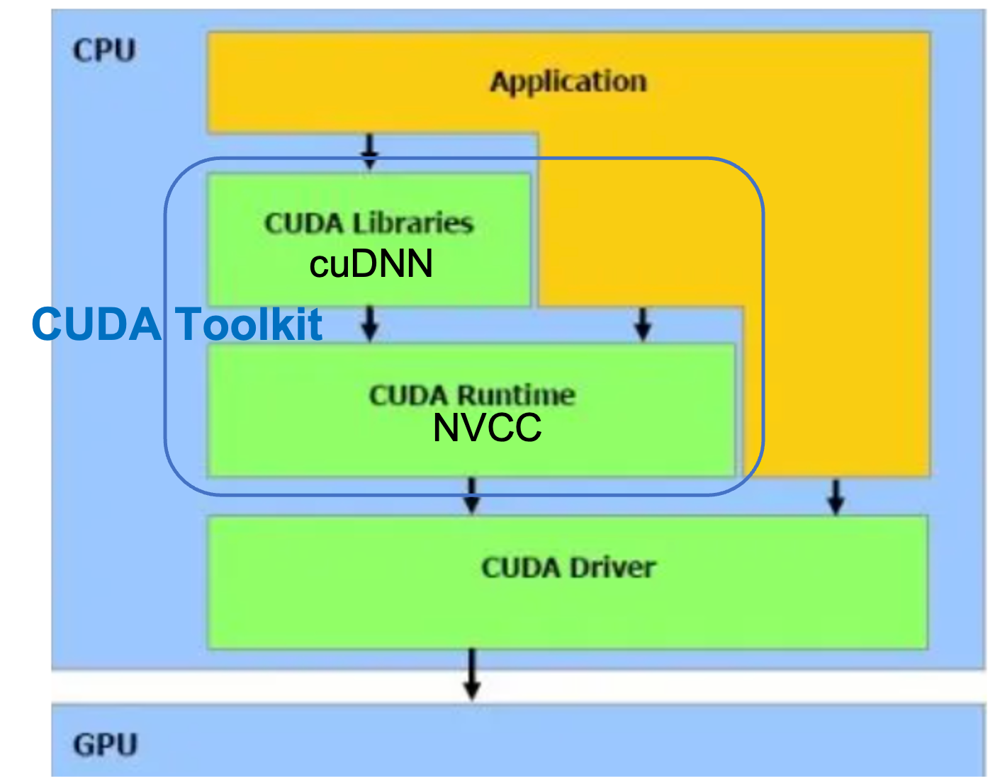

# Technical-notes
### "error in ms_deformable_im2col_cuda: no kernel image is available for execution on the device" when applying [deformable attention](https://github.com/fundamentalvision/Deformable-DETR).
Solution: When the GPU architecture is too new or old, this error happens. We need to specify the GPU architecture in `setup.py`. For example, for my 3080Ti, I add `"-arch=sm_86","-gencode=arch=compute_86,code=sm_86"` to `extra_compile_args["nvcc"]` 
```
        extra_compile_args["nvcc"] = [
            "-DCUDA_HAS_FP16=1",
            "-D__CUDA_NO_HALF_OPERATORS__",
            "-D__CUDA_NO_HALF_CONVERSIONS__",
            "-D__CUDA_NO_HALF2_OPERATORS__",
            "-arch=sm_86",
            "-gencode=arch=compute_86,code=sm_86", #for too new GPU architecture (e.g., 3080Ti), we need to mannually specify the target GPU architecture
        ]

```
（check GPU architecture here: https://qiita.com/k_ikasumipowder/items/1142dadba01b42ac6012）
### Check GPU-related info
```python -c "import torch; print(torch.cuda.is_available())"```
```
pip show torch | grep Location
python /location/torch/utils/collect_env.py
```

### conda pack env
preparasion
```
conda create -name env_name python=3.x
conda activate env_name
# install dependencies
(pip install conda-pack)
conda pack -n env_name
```
use: 
```
mkdir env_name
tar -xzf env_name.tar.gz -C env_name
source env_name/bin/activate
```

### git
```
(git config --local lfs.url <lfs_URL>)
git (lfs) clone <URL>
cd <folder>
(git branch)
(git checkout -b <Branch>)
# work here
git add .
(git status)
git commit -m ""
git (lfs) push (origin <Branch>)
```

### Tensorboard
LOCAL
```
ssh -N -f -L localhost:16045:127.0.0.1:8686 panxiuxi@login.tokyo-dc.sensetime.jp
```

REMOTE
```
tensorboard --logdir=/mnt/lustre/partner/panxiuxi/data_communities/latent-diffusion/logs/ --port 8686

```

OPEN IN LOCAL
```
http://127.0.0.1:16045
```
### cuda-torch version matching
https://pytorch.org/get-started/previous-versions/

### Install opencv3
```
conda install -c https://conda.anaconda.org/menpo opencv3
```

### Install Nvidia driver & CUDA
- Install driver
  ```
  sudo apt update
  ubuntu-drivers devices # check avaliable versions
  sudo apt install nvidia-driver-XXX
  sudo reboot
  nvidia-smi # check nvidia info
  ```
- Install toolkit
  - Download cuda toolkit (runfile) from web & install following prompts
  - When installing, ignore "Driver" because it has been installed
  - ```sudo vim ~/.bashrc```
  - Add followings to the end
  ```
  export CUDA_HOME=/usr/local/cuda-11.4
  export LD_LIBRARY_PATH=$LD_LIBRARY_PATH:/usr/local/cuda-11.4/lib64
  ```
  ```
  (
  cd deviceQuery
  sudo make 
  ./deviceQuerysudo make
  )
  ```
- Install cuDNN
  ```
  sudo cp cuda/include/cudnn.h /usr/local/cuda-11.4/include
  sudo cp cuda/lib64/libcudnn* /usr/local/cuda-11.4/lib64
  sudo chmod a+r /usr/local/cuda-11.4/include/cudnn.h 
  sudo chmod a+r /usr/local/cuda-11.4/lib64/libcudnn*
  cat /usr/local/cuda-11.4/include/cudnn.h | grep CUDNN_MAJOR -A 2
  ```

### CUDA Framework


- CUDA (Compute Unified Device Architecture) is a parallel computing platform, =CUDA Driver + CUDA Toolkit.
- CUDA Toolkit = CUDA Libraries + CUDA Runtime
  - NVCC is CUDA compiler, belonging to CUDA Runtime
  - cuDNN is CUDA Deep Neural Network library, belonging to CUDA Libraries

#### Notes
- Most of Torch functionality directly work upon on CUDA Driver. That is why through [Forward Compatible Upgrade](https://zenn.dev/yuyakato/articles/f93b35d269d245), latest Torch version can partially work.
- For Custom C++ and CUDA Extensions (e.g., python setup.py build develop), Runtime is used. The Toolkit and Driver must be compatible.
- Cudatoolkit installed with conda/pip package is only partial Libraries (without Runtime), incomplete. 
- Some commands:
  - ```nvidia-smi``` shows CUDA driver version
  - ```nvcc –-version``` shows CUDA runtime version
  (driver version >=runtime version)


